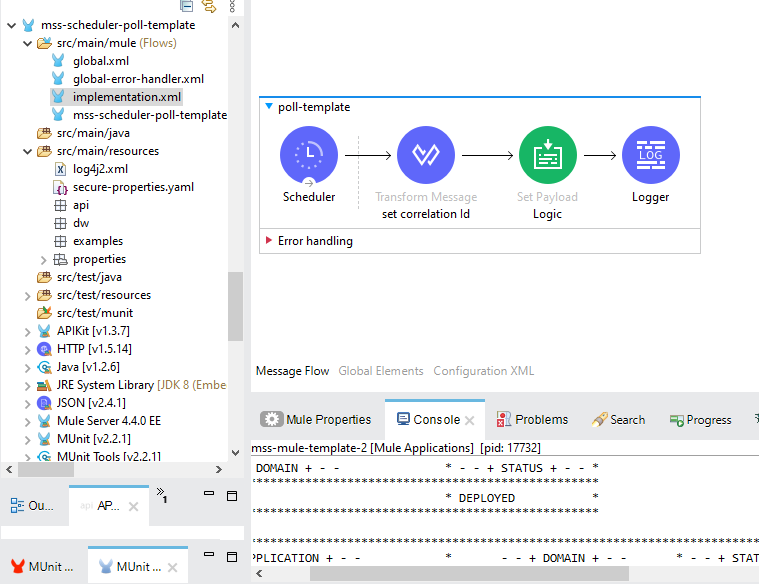
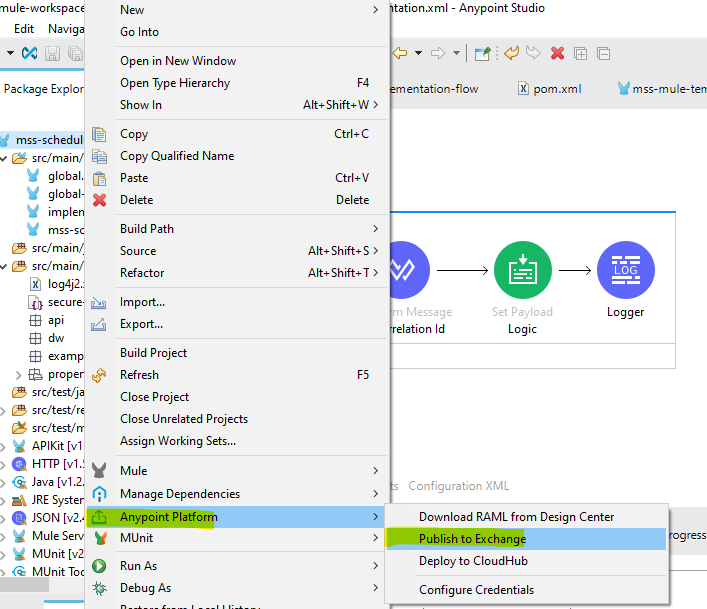
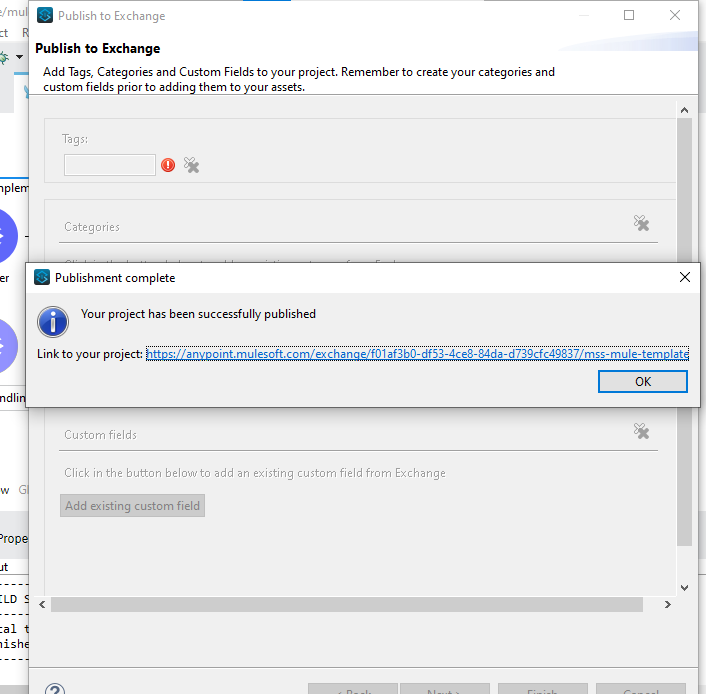
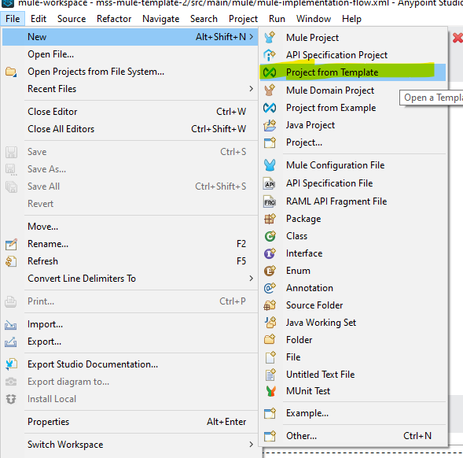
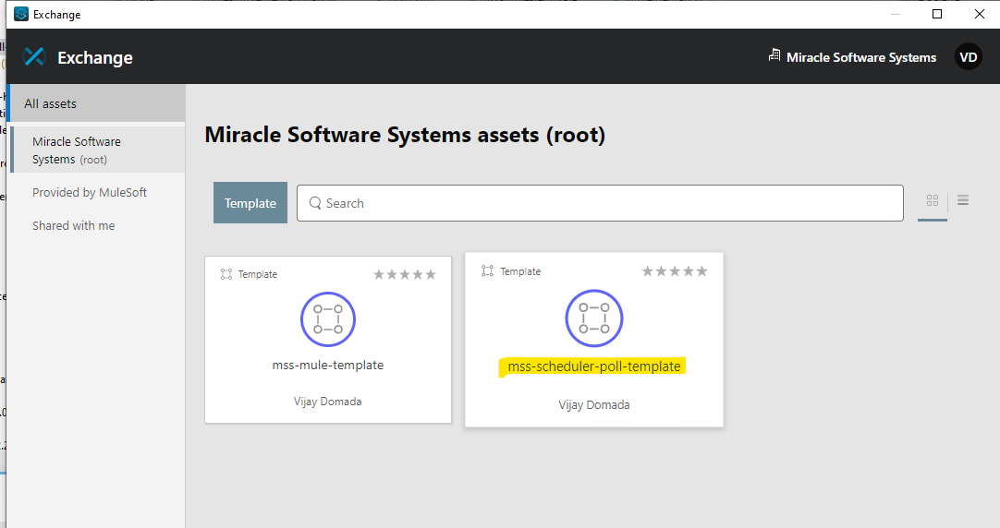

# Mss-Scheduler-poll-api-template

### Poll Template for Mule 4

Poll Templates act as foundations for developers to start building Polling based applications. They need not worry about adding dependencies and is handled by the template. The template utilizes 2 Mule Extensions as follows,

#### Please follow some best practices while creating the template project:Please follow some best practices while creating the template project:

- Define the common error handler as part of template project, either using pom dependency or mule config file
- Define common logger/audit framework as part of the template project
- Define the env specific properties and secure properties file as per the requirement
- Define global.xml for global configuration
- Define the config file for connector configuration like Http,Salesforce,File,FTP etc
- Create separate folders to create DWL,Properties,SSL certificates etc
- Add the dependency and configure the pom.xml as per the business need
- Configure the mule-artifact.json as per the business need

Steps:

1. Create a Mule application

2.Publish in to the exchange

3.Import the template project from exchange

4.Run the application

